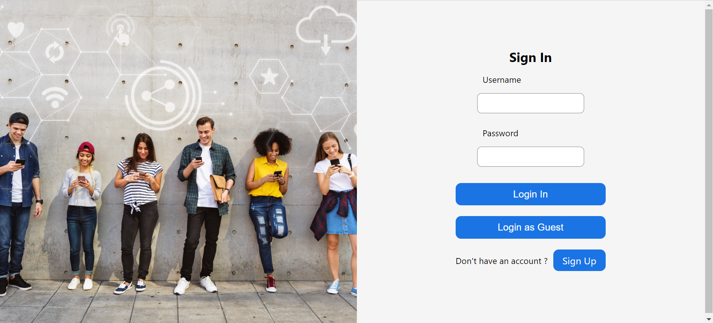
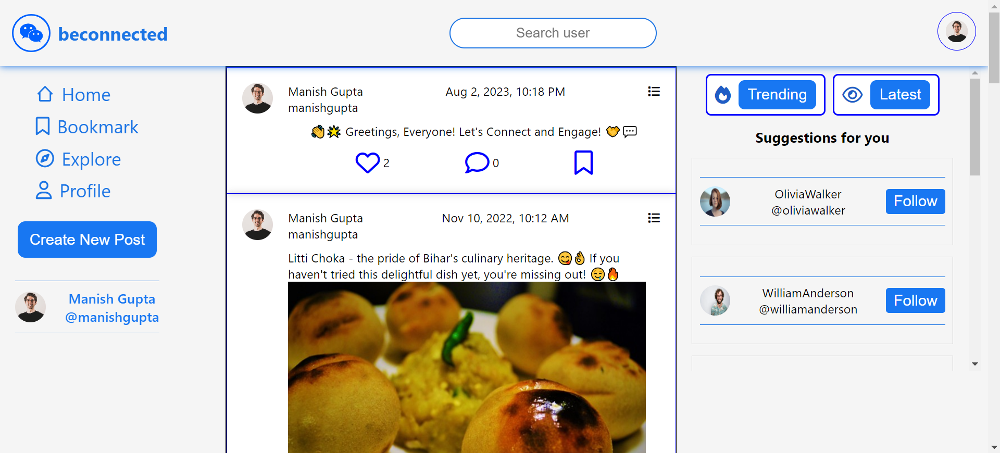
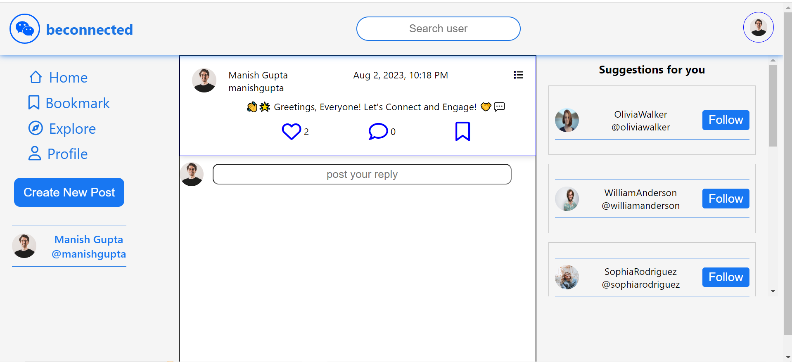
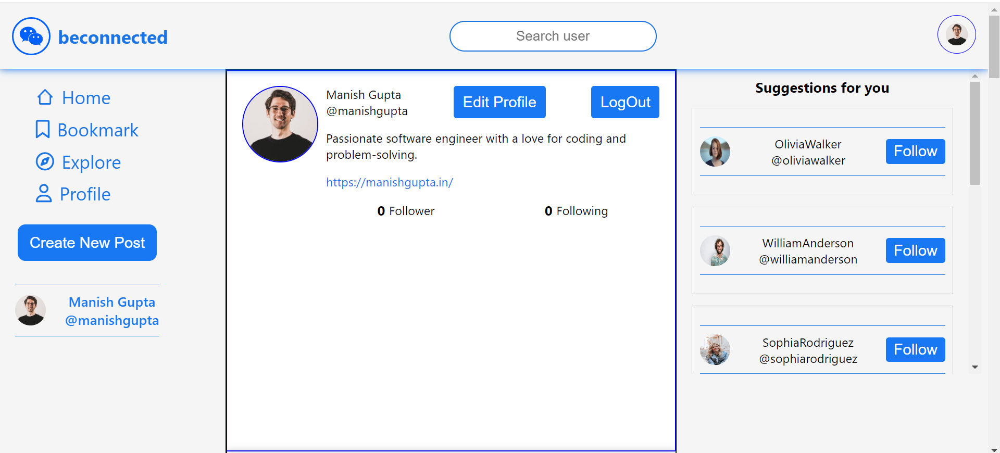
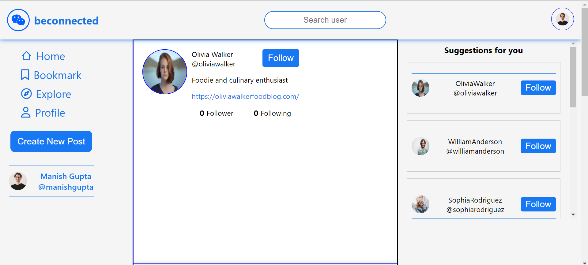

<p align="center" >

</p>

<div align="center" >
<h1 >⚛️ beconnected ⚛️</h1>
</div>

## About

beconnected a social media app where users can create posts, like posts, comment on posts, edit and delete their own posts, edit profile picture , follow and unfollow other users, and explore a feed and bookmarked posts.

## 🚀 Live Link

- [beconnected](https://beconnected-v1.netlify.app/)

## Screens in this project

- Login, Signup Pages
- Home Page
- Explore Page
- Bookmarks Page
- Post Details Page
- User Profile Page
- Peer Profile Page
- 404 (Not Found) Page

## Features

### User feed

- The main landing page displays a feed of user posts.
- User can create new posts with text, images, and emojis.
- Like a posts
- Comment on post
- Bookmark posts
- User can edit and delete their own posts.
- Posts can be sorted by Date and Trending (most likes).
- Search Functionality with user search suggestions.

### Explore Feed

- The Explore feed shows posts from all users, not just those followed.
- User can bookmark posts to save them for later viewing.
- Like , comments on posts
- Infinite scrolling on Explore Page while fetching posts.

### User Profile

- User can edit their profile
- User can choose avatar options for their profile picture.
- User can add a bio and a portfolio URL to their profile.
- User can follow or unfollow other users by visiting their profiles.
- User can logout from there.

### Peer Profile

- User can see other profile.
- LoggedIn User can follow and unfollow their profile
- User can see list of their followers and following

### Post Details

- User can Like , add new comment , and bookmark post
- User can Edit their comment
- User can also delete their comment

### Login

- User can able to login by entering email and password
- User can use guest credentials to login
- Logged in user only can access the app
  Sign Up

### SignUp

- New User can create account to access the app

### Private Routes

- All the user specific routes are made as private routes and can be accessed only after login

### Loaders and Toasts

- Loaders and toast is provided for the acknowledgment to the users

## Technologies Used

- Frontend : React Js , React Context API + useReducer , useState , React Router , Vanilla CSS

- Backend : [Mockbee](https://mockbee.netlify.app/)
- Authentication : JWT

## Getting Started

1. Clone the repository.
   `https://github.com/manishgupta416/beconnected.git`
2. Install dependencies using `npm install`.

3. Create a **.env** file at the root level of the directory (at the level of `package.json` file) and add this as environment variable

```sh
REACT_APP_JWT_SECRET = <JWT_SECRET_KEY_OF_YOUR_CHOICE>
```

4. Start the development server with `npm start`.

## Usage

1. Sign up or log in to access the app's features.
2. Explore the feed, follow users, and bookmark interesting posts.
3. Create your own posts, like and interact with other users' posts.

## 📸 ScreenShots







## Contributing

Contributions are welcome! To contribute to the project, follow these steps:

1. Fork the repository.
2. Create a new branch for your feature or bug fix.
3. Make your changes and commit them.
4. Push your changes to your forked repository.
5. Submit a pull request to the main repository.

## Contact

For any questions or feedback, please contact [Your Name]`(https://github.com/manishgupta416/).`

<h3 align="center">Connect with me 🤝 </h3>
<div align="center">

[](https://www.linkedin.com/in/imanishgupta1/)
[](https://twitter.com/manish_gupta416)

[](mailto:manish.info2020@gmail.com)
[](https://www.instagram.com/manish_gupta416/)

</div>
